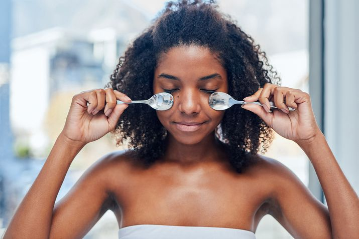
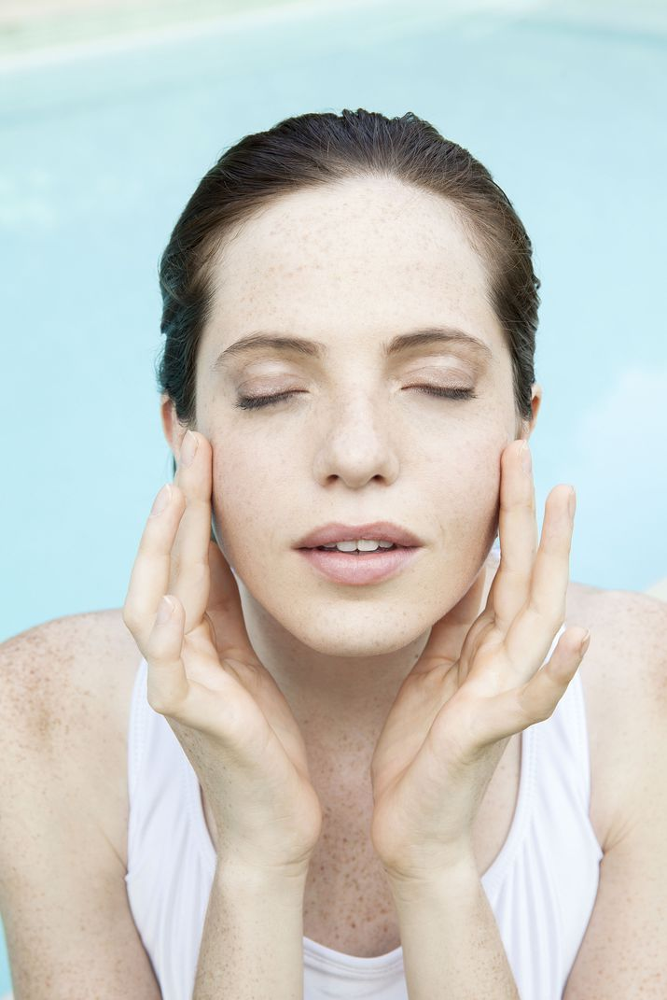

"Los ojos son áreas de piel altamente especializada que es vulnerable a varios sistemas diferentes y susceptible a varios cambios que afectan su apariencia", dice el dermatólogo certificado por la junta, el Dr. Corey L. Hartman. "La genética, la retención de líquidos, las alergias , la exposición al sol, la falta de sueño y la mala alimentación pueden tener un impacto negativo en la apariencia de los párpados superiores e inferiores".

Entonces, ¿cuál es la mejor manera de desinflamar y deshacerse de las bolsas debajo de los ojos de una vez por todas? Más adelante, Hartman y Finney, así como la esteticista licenciada Ali Tobia, divulgan todo lo que necesita saber, incluso por qué algunas cremas para los ojos pueden ayudar.

## Usa una cuchara fría

Uno de nuestros trucos favoritos para ojos hinchados utiliza una herramienta que ya tienes en tu cocina: cucharas. Deje dos cucharaditas limpias en su congelador y, en las mañanas hinchadas, simplemente presiónelas contra sus ojos durante unos minutos. "Esto se puede hacer con una cuchara guardada en el congelador (humedézcala antes de aplicarla en cada área debajo de los ojos durante unos minutos) y ayudará a contraer los vasos y reducir la inflamación en el área", aconseja Finney.

## Use geles de ojos deshinchantes con cafeína

Si bien no podríamos prescindir de nuestra descarga matutina de café, la cafeína también se ha convertido en un jugador estrella en los productos para el cuidado de la piel. " Los geles para ojos con ingredientes activos como cafeína, regaliz y otros antioxidantes son útiles", dice Hartman. “Sobre todo si se enfrían antes de la aplicación”. Intente enfriar sus geles debajo de los ojos con infusión de cafeína favoritos durante la noche, luego aplíquelos por la mañana mientras toma su café.

## Mantente hidratado

Finney advierte que es crucial mantenerse hidratado por muchas razones de salud, pero una de las razones más cosméticas es ayudar a mantener a raya la hinchazón. "Cuando estás deshidratado, tu cuerpo trata de retener todo el líquido que puede, lo que podría contribuir a la hinchazón debajo de los ojos". Los estudios han encontrado que la ingesta de agua ideal para los hombres asignados es de 3000 ml y de 2200 ml para las mujeres asignadas.

## Invierta en una excelente crema para los ojos y utilícela constantemente

Cuando compre remedios para la zona debajo de los ojos, "busque una buena crema hidratante para los ojos con ingredientes como té verde, cafeína, niacinamida, péptidos y otros antioxidantes, que pueden ayudar a reducir la inflamación y contraer los vasos sanguíneos para reducir la hinchazón", aconseja Finney.

"Mi favorito absoluto es el tratamiento restaurador de ojos Alastin , que tiene propiedades antiinflamatorias pero también contiene un péptido que estimula el colágeno para ayudar a mejorar las arrugas y otros signos del envejecimiento", dice. "La mejor parte es que no es irritante. Muchas cremas para los ojos que prometen reducir las arrugas contienen retinol , y aunque el retinol es excelente para combatir el envejecimiento, a menudo puede ser irritante en el área de los ojos, dado que la piel alrededor del ojo es el más delgado y más sensible en cualquier parte del cuerpo".

## Pruebe los rodillos suaves para mejorar el drenaje linfático

Finney explica: "[El área debajo de los ojos] es un área del cuerpo donde nuestro sistema de drenaje natural (sistema linfático) para el exceso de líquido no es el mejor, algunos sufren peor que otros. Hay diferentes formas de lograr [drenaje] que incluyen rodillos de hielo (doble acción ayudando a masajear y enfriar directamente la zona), rodillos de jade , etc. Sin embargo, advierte que "frotar con frecuencia la piel en esta área puede provocar decoloración y una apariencia arrugada".

Hartman se hace eco de este sentimiento: "Los rodillos para ojos son una forma de proporcionar un masaje suave en el área y son bastante efectivos si se usan con regularidad, simplemente no apliques demasiada presión o puede desencadenar más inflamación".

## Prueba una técnica suave de doble toque o masaje facial

¿Sabías que la forma en que aplicas la crema hidratante para ojos afecta el estado del área debajo de los ojos? Tobia dice: "Frotar crema o humectante en los ojos puede hacer que se hinchen. En su lugar, intente tocar suavemente el área de los ojos y masajear los puntos de presión para estimular el drenaje linfático".

Hartman está de acuerdo y advierte que un simple y suave golpecito con el dedo anular puede ayudar mucho a drenar la acumulación de linfa que causa la hinchazón.

Tobia instruye: "Comenzando con el cuello para iniciar el drenaje, arrastre la parte posterior de los nudillos hacia abajo a lo largo de los lados del cuello. Luego, suba por la cara, moviendo las yemas de los dedos hacia afuera desde el centro de la cara hasta las orejas. . Cuando llegue al área de los ojos, querrá asegurarse de que las yemas de los dedos se deslicen por el hueso justo debajo del ojo con un toque suave". Recomendamos usar un aceite facial durante este proceso para evitar tirones en la piel.

## Tratar las alergias

Si bien le damos la bienvenida a la primavera con sus flores florecientes y su clima agradable, podríamos prescindir de las alergias que la acompañan. "Si tiene alergias estacionales o de otro tipo, es muy común tener hinchazón adicional debajo de los ojos", dice Finney. Recomienda: "Si nota un cambio estacional en sus ojos, pruebe un antihistamínico de venta libre como Zyrtec o Allegra todos los días durante la época del año en que sus alergias aumentan".

## Dormir mas

Hartman recomienda dormir de ocho a 10 horas por noche para ayudar a controlar la hinchazón. Y mientras estás en eso, él dice que trates de mantener la cabeza elevada durante la noche.

Finney está de acuerdo: "Si tiene falta de sueño, por lo general empeora la hinchazón", dice. "Una solución que a menudo se pasa por alto para desinflamar el área de los ojos y que puede producir resultados sorprendentes es simplemente dormir en una posición más elevada. Intente agregar una almohada adicional para ayudar a elevar la cabeza y permitir que el líquido se drene más fácilmente por la noche".

## Considere un tratamiento en el consultorio con un dermatólogo

Si las opciones en el hogar no funcionan para usted, considere un tratamiento profesional con un dermatólogo certificado por la junta. El mejor tratamiento para usted puede variar según su inquietud individual, pero, en general, Hartman dice que el mejor tratamiento para la hinchazón debajo de los ojos suele ser la microaguja de radiofrecuencia.

"Los dispositivos de microagujas de radiofrecuencia como Lutronic Genius insertan agujas diminutas (después de la aplicación de una potente crema anestésica) que calientan el tejido dérmico, reducen la grasa y el edema, y ​​tensan la piel para proporcionar una superficie firme y lisa", dice. Tenga cuidado con los spas médicos que ofrecen este tratamiento y, en su lugar, visite a un dermatólogo certificado por la junta.