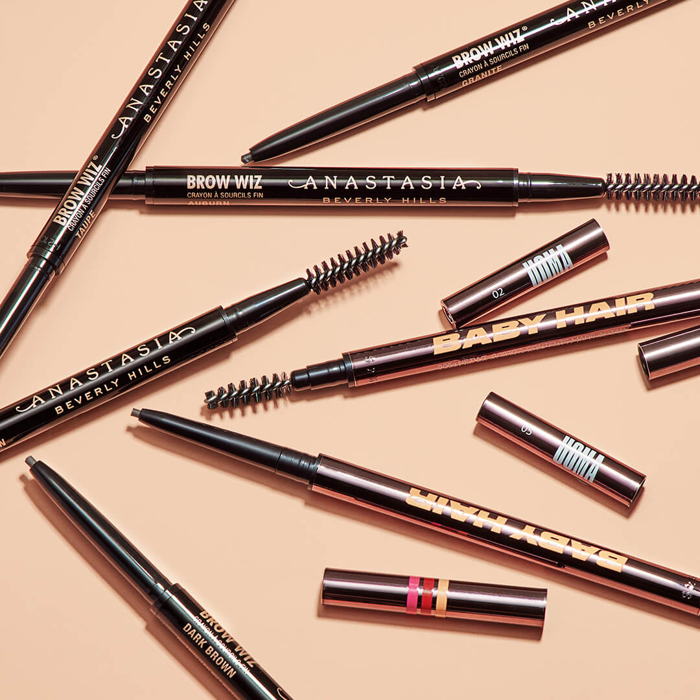
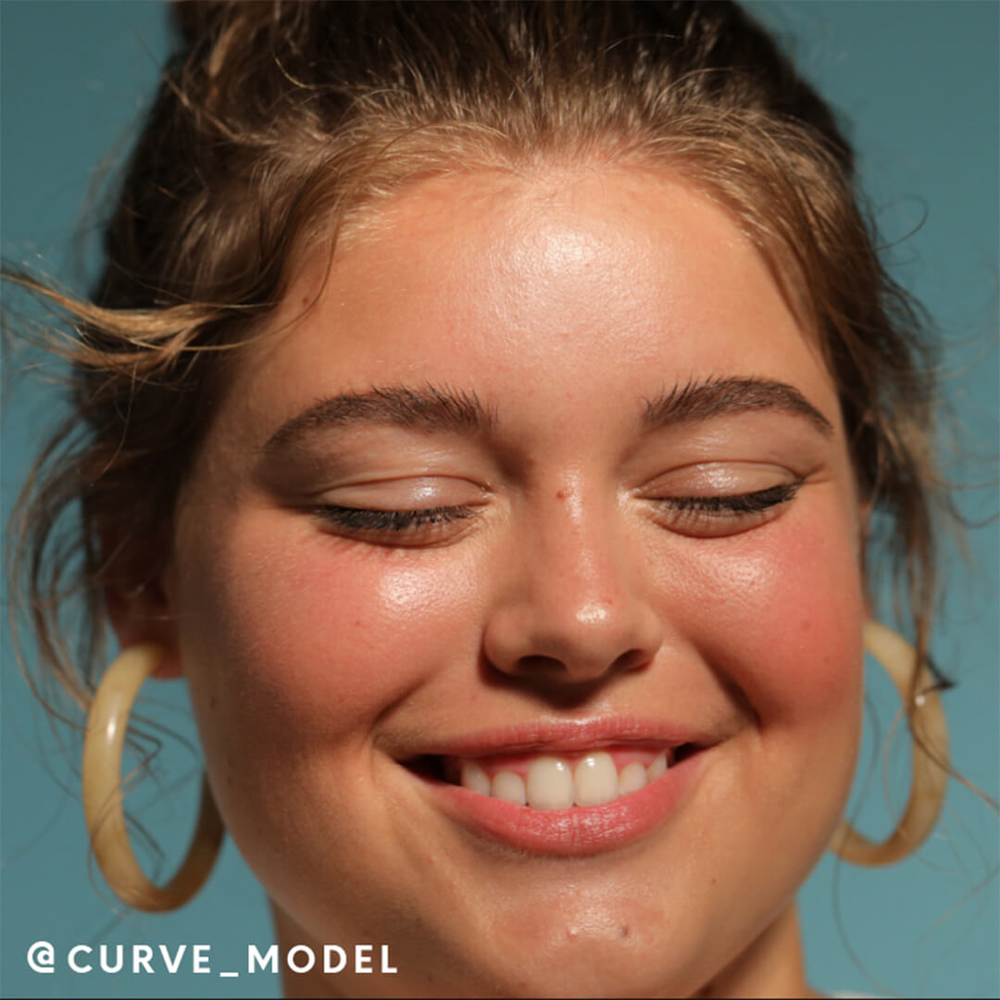
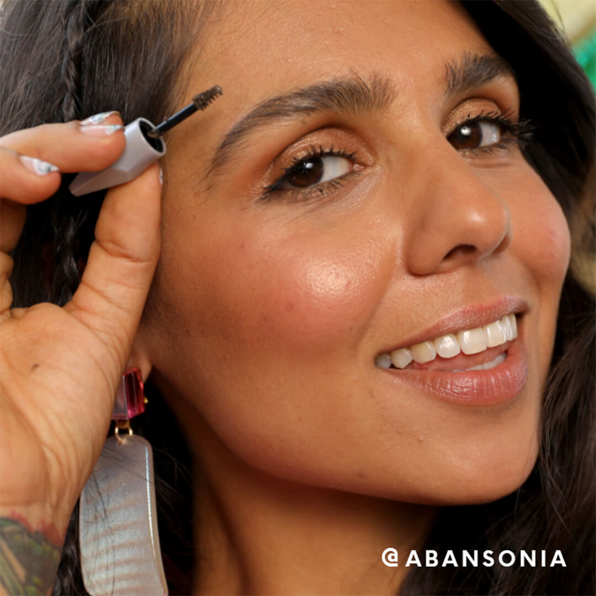
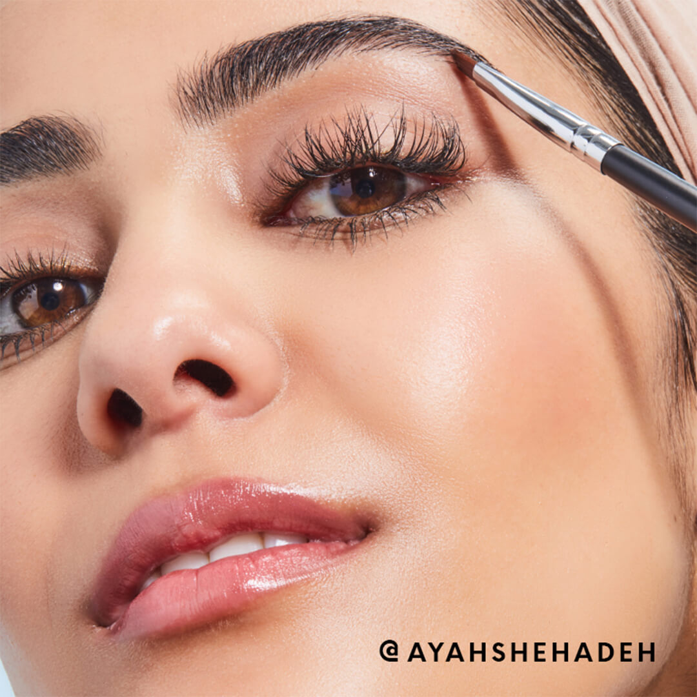

Siga a continuación y le enseñaremos cómo arreglar sus cejas como un maquillador profesional en cinco simples pasos. Y para aquellos que realmente buscan realzar sus cejas naturales a alturas nuevas y más audaces (piensen en Cara Delevingne y Lily Collins), estos trucos para conseguir cejas más gruesas les ayudarán en poco tiempo.

## Lo que necesitarás para hacer tus cejas
Lo primero es lo primero, tendrás que preparar tu equipo. Hemos reunido los productos y las herramientas que necesitará para un aseo adecuado. 

- **Un cepillo para cejas :** Busque un cepillo para cejas en ángulo, como el cepillo para cejas BILLION DOLLAR BROWS para ayudar con la aplicación precisa de las cejas. Bonificación: este cepillo cumple una doble función; tiene un cepillo de carrete en el otro extremo que puede usar para mezclar y arreglar.
- **Pinzas :** Con una punta angulada súper precisa, con puntas inclinadas y puntiagudas de precisión, estas pinzas de precisión ARACELI BEAUTY te ayudan a dar forma fácilmente a tus cejas y agarrar los vellos diminutos y rebeldes de las cejas como un verdadero experto en cejas, ya sea que tengas cejas muy escasas o gruesas y los gruesos.
- **Lápiz de cejas :** Descubrimos que los lápices de precisión, como ANASTASIA BEVERLY HILLS Brow Wiz® (que viene en 12 tonos para cubrir todas las necesidades de color de cejas) y UOMA Brow-Fro Baby Hair Ultra Slim Brow Defining Pencil (nos encanta la punta delgada y triangular que ayuda a garantizar el control y precisión.), funcionan mejor para dibujar trazos similares a cabellos cuando rellenas las cejas. Ambos lápices de cejas aprobados por Ipster crearán las cejas más naturales pero perfectas.
- **Gel para cejas :** Gel para cejas transparente o con color: tú decides. De cualquier manera, un buen gel para cejas es imprescindible al hacer tus cejas. Pase el gel por el vello de las cejas para domar, suavizar, dar forma y teñir las cejas al instante.
- **Brow Powder o Brow Pomade :** Cuando se trata de construir tus cejas, tienes opciones. Elige la fórmula que prefieras y te resulte cómodo aplicarla. Nos encantan los dos tonos complementarios de polvo en NOMAD COSMETICS Multi-Perfection Duo Brow Powder y el suave acabado natural de PATRICK TA BEAUTY Major Brow Shaping Wax in Clear .
- **Resaltador :** Un iluminador es clave para realmente realzar y definir la forma de tus cejas. El iluminador para cejas High Brow de BENEFIT COSMETICS se desliza sobre los huesos de las cejas y se difumina fácilmente, incluso con los dedos.

## Cómo hacer tus cejas en 5 sencillos pasos

### Paso 1. Encuentra tu forma
Antes de acicalarte, debes determinar la forma de tus cejas . Si bien siempre puede visitar a un estilista de cejas profesional (o un profesional de depilación con cera o hilo ) para comenzar, también puede hacerlo en casa con solo su cepillo de cejas de su kit de herramientas anterior.

Primero, coloque un extremo de la brocha contra la parte exterior de la fosa nasal y el otro extremo en la esquina interna del ojo para que parezca una línea recta vertical. Aquí es donde querrás que comience la parte delantera de la ceja. Haz un pequeño punto con tu lápiz de cejas para marcar el lugar y luego repite en la otra ceja.

A continuación, mueva la parte superior de la brocha para alinearla con su pupila. El lugar donde el cepillo se superpone a la ceja es donde debe ubicarse el arco ideal . Márcalo con otro punto de tu lápiz de cejas, luego repite en tu otro ojo.

Por último, mueva la parte superior de la brocha a la esquina exterior de su ojo (todavía mantenga la parte inferior de la brocha junto a su fosa nasal). Aquí es donde debería terminar la forma ideal de tus cejas. Márcalo con un punto y repite en el otro lado. Conecta todos los puntos hasta que se delineen tus cejas, ¡y listo!

### Paso 2. (¡Cuidado!) Hora de depilarse con pinzas
Ahora que ha encontrado la forma perfecta de sus cejas, es hora de usar sus pinzas para arrancar cualquier vello que se salga de esta forma. Si lo que buscas es una forma de cejas más tupida y con plumas , siéntete libre de omitir este paso por completo.

Para eliminar todo el vello que estás arrancando, busca la raíz con el borde de las pinzas y tira en la dirección del crecimiento del vello. Busque perros callejeros que estén claramente por encima o por debajo de sus arcos; estos son un juego justo. El área entre los ojos (en el puente superior de la nariz) es otro punto de acceso para los vellos sueltos que se pueden depilar con pinzas.

Asegúrate de alternar entre ambas cejas al depilarte con pinzas y mírate rápidamente en el espejo después de cada depilación, esto te permitirá mantenerlas uniformes. Y, por supuesto, tenga cuidado al arrancar y no se vuelva loco con las pinzas. Las tendencias de maquillaje de los años 90 están de regreso, pero afortunadamente las cejas finas no son una de ellas. Así que recuerda, siempre puedes regresar más tarde si encuentras otro perro callejero, pero es mucho más difícil (y toma más tiempo) que el vello de tus cejas vuelva a crecer si terminas depilándolo demasiado.

### Paso 3. Cepíllate y toma tu gel para cejas
¿La forma más rápida de crear cejas pulidas? Usando un gel para cejas, sin duda. El gel para cejas es súper rápido y fácil de aplicar, y si tienes prisa o buscas un estilo de maquillaje sin maquillaje , incluso puedes detenerte después de este paso.

Retira el cepillo en espiral similar a una máscara de pestañas del tubo de tu gel para cejas (nos encanta el tinte natural de BROW ATELIER Groom & Sculpt Tinted Brow Gel ), asegurándote de que el extremo del cepillo para cejas esté cubierto uniformemente con gel. Si la varita se ve grumosa, simplemente limpie un poco el borde del tubo, y si se ve demasiado desnuda, bombéela dentro del tubo una vez más.

Luego, cepilla desde la base de los vellos de tus cejas y muévete hacia arriba y hacia afuera, comenzando desde la esquina media o interna de tus cejas. El gel te ayudará a mantener tu figura y suavizará el vello rebelde.

Un gel para cejas teñido ayudará a crear un poco de color y una forma de cejas más fuerte, pero también puedes usar un gel transparente para una apariencia súper limpia y natural (estos también funcionan maravillosamente para suavizar los cabellos sueltos).

### Paso 4. Aplica tu producto para cejas
El siguiente paso: construir tus cejas. Usando su lápiz de cejas, comience en el medio de su ceja y mueva suavemente el lápiz hacia arriba, haciendo trazos pequeños, como cabellos, para rellenar cualquier espacio vacío o vacío. Trate de sostener el lápiz ligeramente y aplique una presión suave: desea imitar los pequeños vellos que forman sus cejas, y presionar demasiado puede provocar que el pigmento se bloquee y forme grumos.

Para imitar el crecimiento natural de los vellos de las cejas , por lo general es más fácil comenzar a dibujar las cejas en la parte inferior de las cejas, cerca de las raíces del cabello, y seguir hacia arriba. Una vez que se hayan llenado todos los espacios dispersos, siéntase libre de volver y agregar más, creando la plenitud y la definición que desea.

Fija el look con tu polvo o pomada para cejas, eligiendo un tono que coincida con el color de tus cejas. ¿No estás seguro de qué color elegir? Una buena regla general para el maquillaje de cejas de aspecto natural es tratar de elegir productos que sean uno o dos tonos más claros que el color de tus cejas (confía en nosotros, seguirá teniendo un impacto). Aplicar con una mano ligera; siempre puedes regresar y agregar otra capa para una ceja más audaz.

Y mientras construyes y rellenas tus cejas, ten en cuenta estos consejos adicionales:

- Asegúrate de que el arco no sea muy puntiagudo. Si comienza a verse demasiado obvio, difumínalo con tu cepillo para cejas o cepillo para cejas.
- No extienda demasiado la cola de las cejas, esto puede crear una apariencia caída y hacer que se vea cansado o sorprendido. Recuerde, sus cejas generalmente no deben pasar de la esquina exterior de su ojo (¡vea el paso 1 si necesita un recordatorio de dónde terminar la forma de su ceja!)
- Las líneas y ángulos ásperos a veces pueden hacer que tus cejas se vean exageradas, pero no te estreses si esto sucede: generalmente es solo porque aplicaste demasiado producto. Para arreglarlo, simplemente límpielo suavemente con su brocha spoolie o sumerja un hisopo en un desmaquillador para borrar y reconstruir esa sección.
  

### Paso 5. Resaltar y enfocar
Acentúa todo ese trabajo que acabas de poner en tus cejas con un iluminador. Pasar el iluminador justo debajo y justo encima del arco de la ceja realmente puede esculpir el área de la ceja y enfatizar la forma de las cejas. Luego, simplemente difumínalo con tu dedo anular. ¿Notas alguna mancha alrededor de tus cejas? Usa un poco de corrector para un retoque rápido. Recuerde, la práctica y la experimentación son la clave. No hay un solo look de frente "derecho". Así que juega y encuentra el look (o looks) que te encanta.
